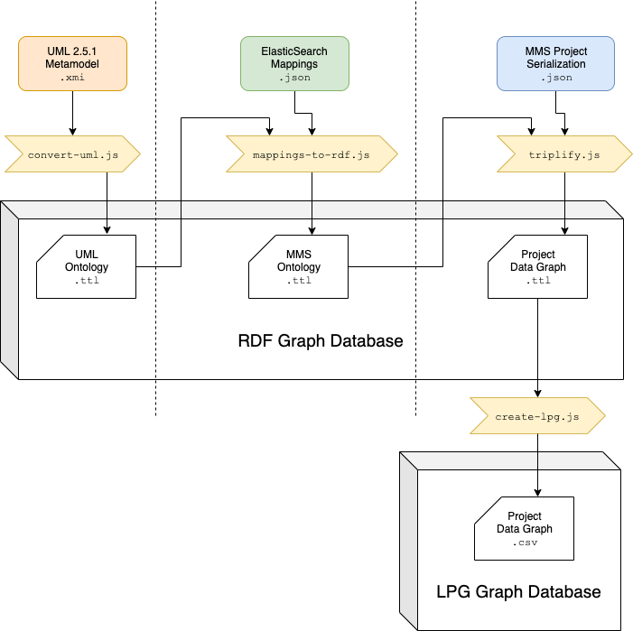

# MMS-RDF



## Slides

[See slides here.](docs/MMS%20in%20RDF.pdf)

## Difference Between RDF Graph and LPG
The generated labelled property graph (LPG) is a view of the Project Data Graph. Its purpose is to provide a means to perform graph traversal queries on instance-level data. The LPG view strictly covers the **datatype properties of**, and **relationships between**, **model elements**. It does not cover the UML and MMS ontologies, so queries that depend on the type hierarchy from the UML metmodel, such as those involving subclass relations, are not supported. In other words, while RDF allows for ABox and TBox statements to exist within the same model, LPGs are mostly suited for ABox statements.

## General Requirements

Node.js version 10.\*, 11.\*, 12.\* .

make (for building native add-ons for node.js; node-gyp)


The following environment variables also need to be set:

 - MMS_SPARQL_ENDPOINT - URL of the SPARQL endpoint (local or remote) which will be updated and queried during triplification, e.g., `http://localhost:13030`.
 - MMS_PROJECT_NAME - name of the project (determines name of generated data graph)
 - MMS_MAPPING_FILE - path to input JSON mapping file(s) (either absolute path or relative to this project root dir)


### Using with AWS Neptune Requirements

The following environment variables need to be set:
 - AWS_ACCESS_KEY_ID
 - AWS_SECRET_ACCESS_KEY
 - ~~NEPTUNE_ENDPOINT~~ - deprecated and removed. use `MMS_SPARQL_ENDPOINT` instead.
 - NEPTUNE_S3_BUCKET - S3 Bucket URI (see example)
 - NEPTUNE_REGION - S3 Bucket region string
 - NEPTUNE_PROXY - (optional) define a proxy to tunnel requests to the endpoint thru (see example)


## Setup
From the project root dir:
1. **Install the npm package:** `$ npm i`
2. **Create an environment variables file.** Here is an example file for local usage:
  **`.local.env`**:
  ```bash
  #!/bin/bash
  export MMS_SPARQL_ENDPOINT=http://localhost:13030/ds
  
  export MMS_PROJECT_NAME=tmt
  export MMS_MAPPING_FILE=input/tmt/mapping/*.json
  
  export MMS_MAX_REQUESTS=32
  export MMS_MAX_SOCKETS=32
  ```
3. **Load the environment variables into you shell session,** `$ source .local.env` .
4. **Ensure that you have a mapping file** located at the `MMS_MAPPING_FILE` path (a default mapping for the TMT project is provided with this repository).
5. **Ensure that you have a project data file** ready to use. If you cloned this repository, you can use the TMT project provided in `./input/tmt/data` but should extract the JSON file from that .tar.gz archive in this step:
  ```console
  $ cd ./input/tmt/data
  $ tar -xzvf tmt_data.json.tar.gz
  ```
6. **If you are connecting to AWS Neptune**, make sure to open a tunnel to an EC2 instance that is within the same VPC as the Neptune cluster:
  ```console
  $ ssh -i aws.pem -D 3031 ubuntu@EC2_IP
  ```


## Getting Started For Local Usage

1. **Follow the steps in [Setup](#setup)** to initialize the project.
2. **Prepare a local triplestore.** A helper bash script is provided at `./util/local-endpoint.sh` which you can run from the command-line. The script will read the port from the `MMS_SPARQL_ENDPOINT` URI string and attempt to launch a named docker container of the Apache Jena Fuseki triplestore with an in-memory database that binds to the host at `0.0.0.0` on the port in the endpoint string (e.g., `:13030`). Be aware that re-running this script will overwrite older containers, i.e., the triplestore may have to be reloaded.
3. **Build the vocabulary graph:** `$ npx emk local.update.vocabulary.*` . It is OK if you see warnings about UML properties having multiple keys, this means the system is handling URI minting conflicts. You can now inspect the source of the vocabulary Turtle files under `./build/vocabulary/`.
4. **Build the instance data graph:** `$ ./util/build-local.sh input/tmt/data/tmt_data.json` . This is a multithreaded build tool that may take a while depending on the size of the input dataset. A progress bar will be printed to console. It is OK if you see warnings about unmapped object keys that begin with an underscore (unmapped metadata properties).
5. **All done!** The script from the previous step will stitch together all the output files into a single master output Turtle file located at `./build/`.

All together, the commands in order with output might look like this:
```console
$ source .local.env
$ ./util/local-endpoint.sh
$ npx emk local.update.vocabulary.*
$ ./util/build-local.sh input/tmt/data/tmt_data.json
```


### Example `.neptune.env` file:

```bash
#!/bin/bash
export MMS_SPARQL_ENDPOINT=http://open-cae-mms.c0fermrnxxyy.us-east-2.neptune.amazonaws.com:8182
export NEPTUNE_S3_BUCKET_URL=s3://open-cae-mms-rdf
export NEPTUNE_S3_IAM_ROLE_ARN=arn:aws:iam::230084004409:role/NeptuneLoadFromS3
export NEPTUNE_REGION=us-east-2
export NEPTUNE_PROXY=socks://127.0.0.1:3031

export MMS_PROJECT_NAME=tmt
export MMS_MAPPING_FILE=input/tmt/mapping/*.json

export AWS_ACCESS_KEY_ID=YOUR_AWS_ACCESS_KEY_ID
export AWS_SECRET_ACCESS_KEY=YOUR_AWS_SECRET_ACCESS_KEY
```


## Building and Uploading RDF for Remote Usage

Build tasks are handled by [emk.js](https://github.com/blake-regalia/emk.js). The following tasks are available:

In the following sections, `TYPE` is a placeholder for either `vocabulary` or `data`.

Building graphs (i.e., triplification):
 - `local.TYPE` - build the given `TYPE` graph locally (e.g., `local.vocabulary` or `local.data`), which outputs graphs as both RDF (in Turtle format) and LPG (in CSV format).

Modifying contents of the remote triplestore:
 - `remote.clear.TYPE` - clear the given `TYPE` graph from the remote triplestore
 - `remote.upload.TYPE` - upload the local `TYPE` graph file to the S3 bucket
 - `remote.update.TYPE` - load the `TYPE` graph from the S3 bucket into the triplestore

*Example:*
```bash
# clear all graphs from remote triplestore
$ npx emk remote.clear.*

# upload vocabulary graph to S3 and then update Neptune
$ npx emk remote.upload.vocabulary remote.update.vocabulary
``` 

The build targets automatically depend on the necessary tasks, so you can simply run:
```bash
$ npx emk remote.update.*
```
which will build the vocabulary and data graphs, upload them to S3, and then update the triplestore.